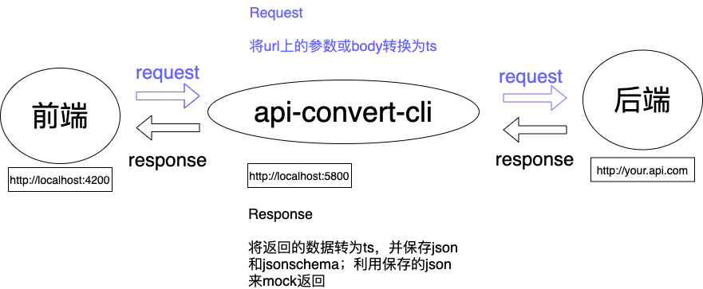

# API-types-automatic-converter

Automatic convert request params and response body of API. Automatic creat json and json-schema of response body . Use [flow](https://flow.org/en/).

## vscode extension

vscode-flow-ide: An alternative Flowtype extension for Visual Studio Code. Flowtype is a static type checker ment to find errors in Javascript programs.

## implement

An intermediate element in the requesting agent. Between development-client and serve.

## publish url

https://internal-nexus.haochang.tv/repository/npm-hc/

## Use

    1. npm -g i api-types-automatic-converter
    2. api-convert-cli init // in this step, change `target` to your api url in convert-config.js
    3. // change `target` of your project proxy config to converter serve url
    4. api-convert-cli start
    5. // run your Angular / React / Vue project serve

## TODO

    1. [x]分离函数，声明类型
    2. [x]支持传入配置
    3. []对接json-server
    4. []样例
