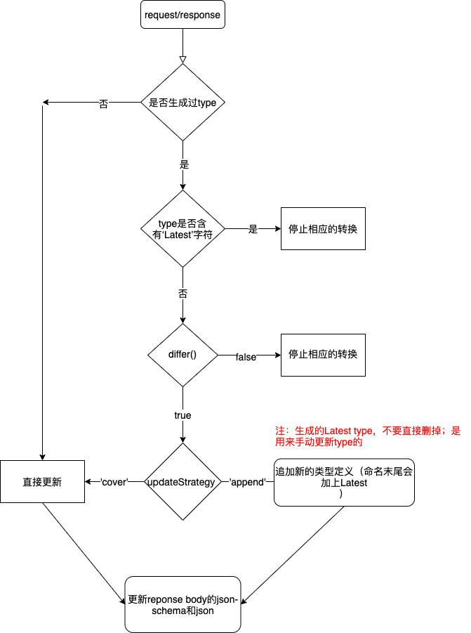

# API-types-automatic-converter

代理 API，自动将请求参数和返回数据转为 ts。使用返回数据自动创建 json、[json-schema](https://json-schema.org/)，当给请求头添加 mock-response 时，将会把保存的
json 作为返回数据，进而实现 mock 的功能。开发此功能使用了[Typescript](https://www.typescriptlang.org/)作为静态检查工具。用 esmodule 编码，但最终编译为 commonjs
的模块。

## 类型检查

用 tsc 编译 ts 并会检查类型，使用的 tsconfig.json 的配置；eslint 用的是.eslintrc.js，只会检查代码结构和样式

## 原理

1. 启动一个处于在前端和后端的中间服务器，通过反向代理让请求从该服务器过，从而劫持请求和响应做自动转换的功能。
2. 支持自定义 differ() 来更新文件；默认是强制更新文件，以最新的 ts 替换原来的，也可以设置为 append，则会把最新 ts 命名为 xxxLatest 的追加到后面；
3. 【请求参数】和【返回数据】都通过 differ() 的返回来决定是否更新，两者的参数略有不同。【请求参数】通过 differ() 判断时没有 schema 和 oldData。所以通过判断这两
   个参数可以分别判断【请求参数】和【返回数据】是否更新。


## 更新策略

覆盖或追加，见配置的 updateStrategy



## 公司私有 npm 仓库发布地址

https://internal-nexus.haochang.tv/repository/npm-hc/

## 公司私有 npm 仓库下载地址

https://internal-nexus.haochang.tv/repository/npm/

## 开始使用

| 命令                                           | 说明         | 参数  | 说明                                                                     |
| ---------------------------------------------- | ------------ | ----- | ------------------------------------------------------------------------ |
| npm i --save-dev api-types-automatic-converter | 安装         |       |                                                                          |
| api-convert-cli init                           | 生成配置文件 | ts js | 可以这样使用：api-convert-cli init js ；不输参数默认是生成 ts 的配置文件 |
| api-convert-cli start                          | 启动服务     | 无    |                                                                          |

根据不同项目，修改已有的代理文件。如果是 Angular，则需要将 proxy.conf.json 中的 target 地址改为 http://localhost:5800

```cmd
npm -g i api-types-automatic-converter // 全局安装
cd [project dir] // 进入项目目录
api-convert-cli init // 执行初始化命令，将会在根目录生成一个配置文件，见‘配置说明’
api-convert-cli start // 修改配置文件后启动，将在本地启动一个服务，若端口设置为5800，那么该服务的地址就是 http://localhost:5800

```

或者在 package.json 配置脚本命令

```json
"scripts": {
 "api-types": "node ./node_modules/api-types-automatic-converter/dist/main.js start",
}
```

## 配置说明

配置中的 proxy 其实就是 [http-proxy-middleware](https://www.npmjs.com/package/http-proxy-middleware) 的配置，但 onProxyReq 和 onProxyRes 是无效的，该库就是通过
它们来劫持的 API

1. js 版

```js
function differ(params) {
	const Ajv = require('ajv');

	const { data, schema } = params;
	const ajv = new Ajv();

	if (schema && data) {
		const validate = ajv.compile(schema);
		const valid = validate(data);

		if (valid) {
			return false;
		}
	}

	return true;
}
module.exports = {
	differ,
	updateStrategy: 'cover', // 'cover' | 'append'
	proxy: { target: 'https://jsonplaceholder.typicode.com', pathRewrite: { '^/api': '' }, changeOrigin: true, secure: false },
	port: 5800,
	filePath: { json: './sample/assets/api-json', types: './sample/src/api-types' },
	ignore: { methods: ['delete', 'options'], reqContentTypes: [], resContentTypes: ['application/octet-stream'] },
};
```

2. ts 版，建议使用这版

```ts
import { DifferParams, APIConverterConfig } from 'api-types-automatic-converter';

function differ(params: DifferParams): boolean {
	const { data, oldData, typeContent, oldTypeContent, schema } = params;
	if (!Object.keys(data as any).length) {
		return false;
	}

	// 请求参数变多了
	if (!schema && oldTypeContent && typeContent.length > oldTypeContent.length) {
		return true;
	}

	// 响应的数据结构变化了
	if (schema && data) {
		const tmp: any = data;
		const Ajv = require('ajv');
		const ajv = new Ajv(); // options can be passed, e.g. {allErrors: true}
		const validate = ajv.compile(schema);
		const valid = validate(data);
		if (!valid && Object.keys(tmp.data).length) {
			console.log(validate.errors);
			return true;
		}
	}

	return false;
}
module.exports = {
	differ,
	proxy: { target: 'https://jsonplaceholder.typicode.com', pathRewrite: { '^/api': '' }, changeOrigin: true, secure: false },
	updateStrategy: 'cover',
	port: 5800,
	filePath: { json: './sample/assets/api-json', types: './sample/src/api-types' },
	ignore: { urls: [], methods: ['delete', 'options'], reqContentTypes: [], resContentTypes: ['application/octet-stream'] },
} as APIConverterConfig;
```

## TODO

1. [x]分离函数，声明类型
2. [x]支持传入配置
3. [x]配置支持 ts
4. []对接 json-server
